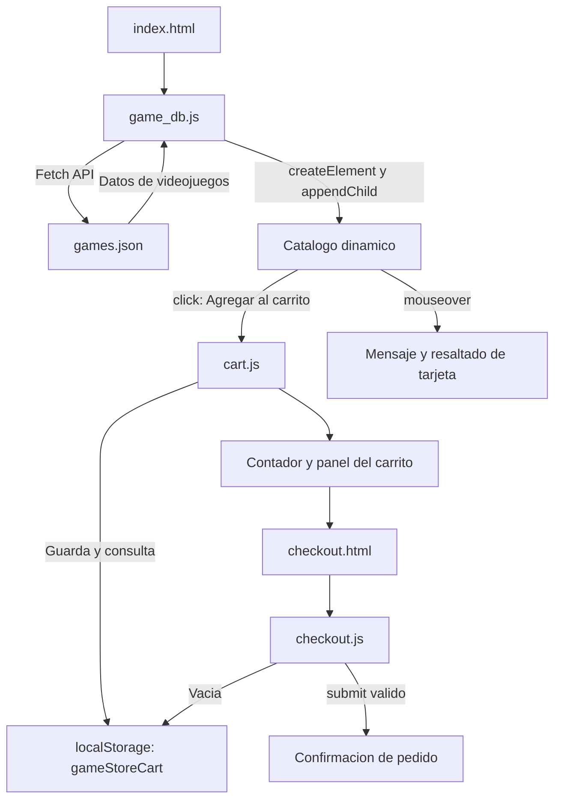

# Informe de Entrega: Game Store Interactiva

**Asignatura:** Desarrollo Frontend I  
**Actividad:** Manipulando el DOM con JavaScript para mejorar la interactividad  
**Estudiante:** Karla Santibáñez   
**Fecha de entrega:** 09/09/2026

## 1. Descripcion del proyecto

Game Store es una tienda web de videojuegos desarrollada con HTML, CSS, Bootstrap y JavaScript. El proyecto evoluciono desde un catalogo estatico a una aplicacion interactiva: carga los juegos desde un archivo externo, construye el contenido en el DOM y permite simular un proceso de compra mediante un carrito persistente y una pantalla de pago educativa.

## 2. Objetivo

Aplicar manipulacion del DOM, eventos de JavaScript y la Fetch API para mejorar la interactividad de una pagina web existente, manteniendo una estructura de codigo clara, reutilizable y documentada.

## 3. Desarrollo de la actividad

### 3.1 Manipulacion del DOM

El archivo [src/js/api/game_db.js](src/js/api/game_db.js) crea las tarjetas del catalogo despues de recibir los datos. La funcion `createGameCard()` utiliza `createElement` para construir cada elemento visual y `append`/`appendChild` para insertarlo en la pagina. La funcion `renderGamesByCategory()` filtra los juegos por categoria y actualiza cada contenedor dinamicamente.

El carrito tambien modifica el DOM en tiempo real: muestra productos, cantidades, totales y el contador ubicado en la barra de navegacion.

### 3.2 Eventos implementados

| Evento | Elemento | Resultado de la interaccion |
| --- | --- | --- |
| `click` | Botones **Agregar al carrito** y controles del carrito | Agrega, incrementa, disminuye, elimina o vacia productos; actualiza la cantidad y el total. |
| `mouseover` | Tarjetas de videojuegos | Resalta la tarjeta sobre la cual se encuentra el cursor y muestra su descripcion en el estado del catalogo. |
| `submit` | Formulario de [checkout.js](src/js/checkout.js) | Valida los campos requeridos, muestra una confirmacion de pedido y vacia el carrito cuando los datos son validos. |

### 3.3 Uso de Fetch API

El catalogo se encuentra en [games.json](src/data/games.json). La funcion `loadGames()` ejecuta `fetch("./data/games.json")`, verifica la respuesta HTTP y convierte la respuesta con `response.json()`. Luego, procesa los datos con `then()` y los muestra dinamicamente.

Si la carga falla, `catch()` registra el error en consola y muestra un mensaje visible para la persona usuaria. Esta implementacion evita que un fallo de red deje la pagina sin retroalimentacion.

### 3.4 Organizacion y buenas practicas

La logica esta organizada por responsabilidad:

- [src/js/api/game_db.js](src/js/api/game_db.js): carga de datos externos y creacion de tarjetas.
- [src/js/cart.js](src/js/cart.js): operaciones del carrito, persistencia mediante `localStorage` y actualizacion visual.
- [src/js/checkout.js](src/js/checkout.js): resumen del pedido y validacion del formulario.
- [src/js/carrusel.js](src/js/carrusel.js): control accesible del carrusel de destacados.

### Mapa del codebase

```text
DF_I-Fundamentos_HTML_CSS/
|-- README.md                         Informe de entrega y evidencias
|-- docs/
|   |-- catalogo-interactivo.png      Captura del catalogo dinamico
|   `-- checkout-interactivo.png      Captura del flujo de pago
`-- src/
    |-- index.html                    Pagina principal y catalogo
    |-- checkout.html                 Pagina de pago simulado
    |-- css/
    |   `-- style.css                 Estilos propios sobre Bootstrap
    |-- data/
    |   `-- games.json                Fuente externa del catalogo
    `-- js/
        |-- api/
        |   `-- game_db.js            Fetch API y renderizado del catalogo
        |-- cart.js                   Carrito y almacenamiento local
        |-- carrusel.js               Pausa y reanudacion del carrusel
        `-- checkout.js               Resumen y validacion del pago
```

### Flujo de datos e interaccion



Las funciones principales contienen comentarios que describen su proposito y el flujo de trabajo. Se usaron funciones reutilizables para evitar la repeticion de codigo.

## 4. Validacion realizada

Se realizaron las siguientes comprobaciones:

- Validacion del archivo JSON: se confirmaron 12 videojuegos disponibles para cargar.
- Prueba mediante servidor HTTP local: la solicitud a `data/games.json` respondio con codigo `200`.
- Revision de sintaxis: los archivos JavaScript del catalogo, carrito y pago no presentan errores de sintaxis.
- Prueba funcional en navegador: se comprobaron 12 tarjetas y 12 botones generados dinamicamente.
- Prueba de eventos: se verifico el cambio visual de `mouseover`, la actualizacion del contador tras `click` y la visualizacion del resumen de compra antes de enviar el formulario.

La pagina se probo en un navegador basado en Chromium. Para una validacion completa del indicador de compatibilidad, se recomienda repetir estas acciones en Firefox y Microsoft Edge.

## 5. Evidencias

### Catalogo dinamico y evento `mouseover`


### Carrito y pantalla de pago con productos almacenados dinamicamente


## 6. Instrucciones de ejecucion

La Fetch API requiere un servidor HTTP; por ese motivo, el proyecto no debe abrirse directamente con `file://`.

```powershell
cd src
python -m http.server 8080
```


  
pO utilizando una extensión para levantar un servidor https
- 
[Live Serv | Ritwick Deyer](https://marketplace.visualstudio.com/items?itemName=ritwickdey.LiveServer)- [Live Preview | Microsoft(https://marketplace.visualstudio.com/items?itemName=ms-vscode.live-server)
 


Luego, abrir `http://localhost:8080` en el navegador.

## 7. Repositorio y entrega

**Repositorio GitHub:** [kbsg01/DF_I-Fundamentos_HTML_CSS](https://github.com/kbsg01/DF_I-Fundamentos_HTML_CSS)

El repositorio contiene el codigo fuente, este informe y las capturas de evidencia. Antes de entregar, se debe verificar que los cambios esten publicados en la rama principal mediante `git status`, `git add .`, `git commit` y `git push`.

## 8. Conclusion

La actividad permitio transformar una tienda estatica en una experiencia interactiva. Se aplicaron correctamente manipulacion del DOM, eventos y consumo de datos externos con Fetch API. Como resultado, el catalogo se carga de forma dinamica, las acciones del usuario generan retroalimentacion inmediata y el flujo de compra demuestra la integracion de los contenidos trabajados durante la semana.
