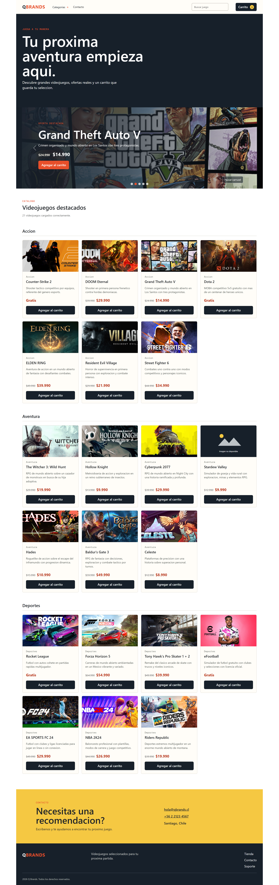
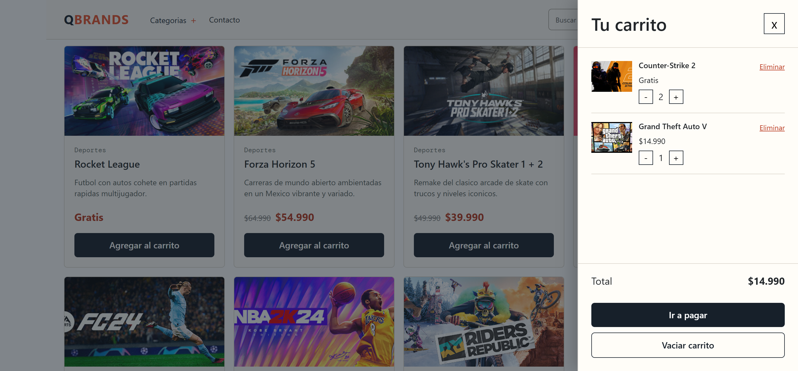
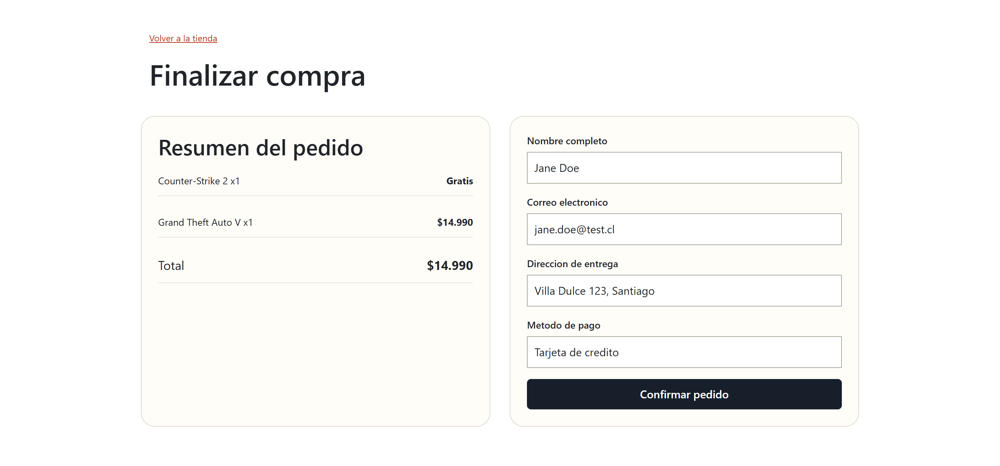

# Q Brands

Tienda de videojuegos construida con React y Vite. Migra la funcionalidad de S6 desde JavaScript imperativo a componentes funcionales y estado declarativo.

## Funcionalidades

- Catalogo remoto de productos con nombre, imagen, descripcion, precio normal y precio oferta.
- Base local ampliada a 21 videojuegos, cargada por `fetch` desde un JSON independiente.
- Carrusel de ofertas, buscador en la barra superior, dropdown de categorias, contacto y footer responsivo.
- Animaciones de entrada activadas al entrar al viewport con `animate.js`, desplazamiento al interactuar con las tarjetas y respeto por `prefers-reduced-motion`.
- Bootstrap aplicado a grillas, tarjetas, formularios, botones, navegación y panel del carrito.
- Placeholders accesibles para hero, carrusel, catálogo, contacto y footer durante la carga; los fallos transitorios se reintentan con backoff progresivo.
- Buscador controlado y categorias navegables.
- Carrito persistente con `localStorage`: agregar, incrementar, disminuir, eliminar, vaciar, contador y total.
- Checkout condicional con formulario nativo validado y confirmacion de pedido.

## Arquitectura

- `src/services/catalogApi.js`: carga del JSON, manejo de errores y reintentos.
- `src/hooks/useCatalog.js`: estado de carga del catalogo.
- `src/context/CartContext.jsx`: estado y persistencia del carrito mediante `useReducer`.
- `src/components/`: componentes de producto, carrito y checkout.
- `public/data/products.json`: catalogo independiente de la interfaz.

## Desarrollo

```bash
npm install
npm run dev
npm run lint
npm run build
```

## Evidencias para publicacion







La publicacion debe usar el resultado de `npm run build` y verificar los enlaces desde el sitio desplegado.
