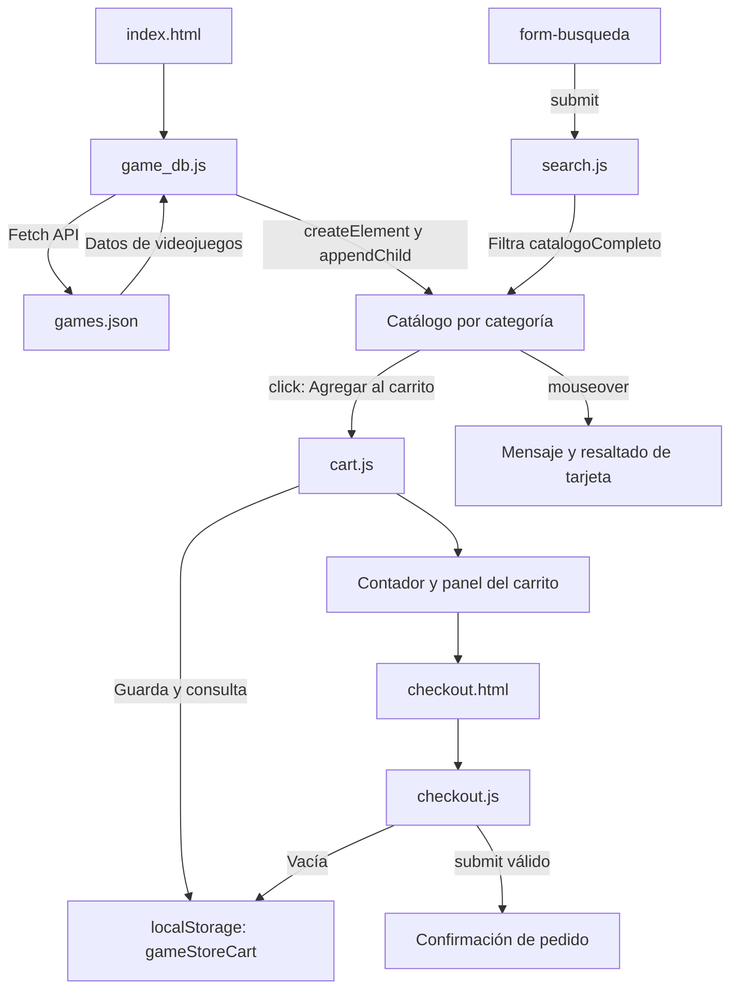
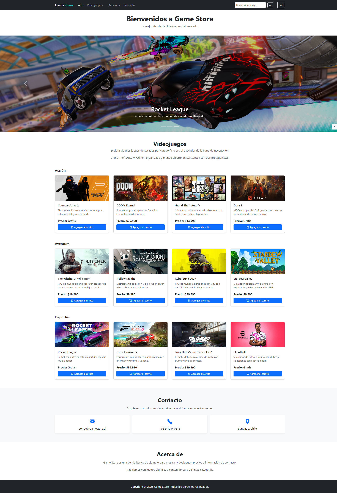
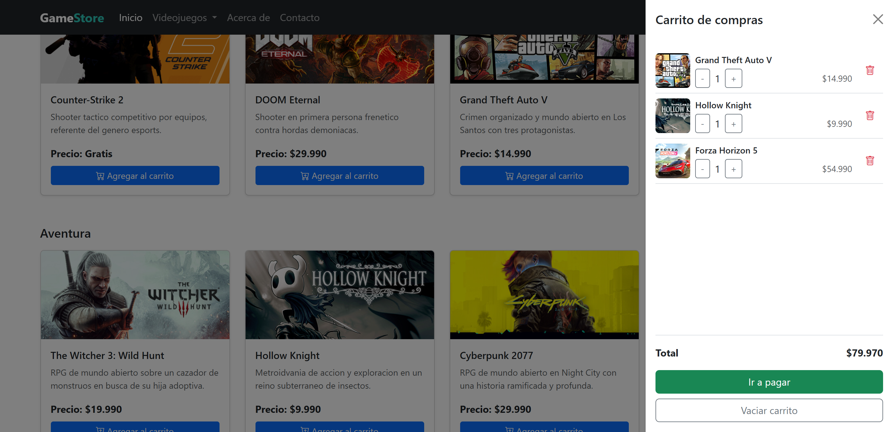
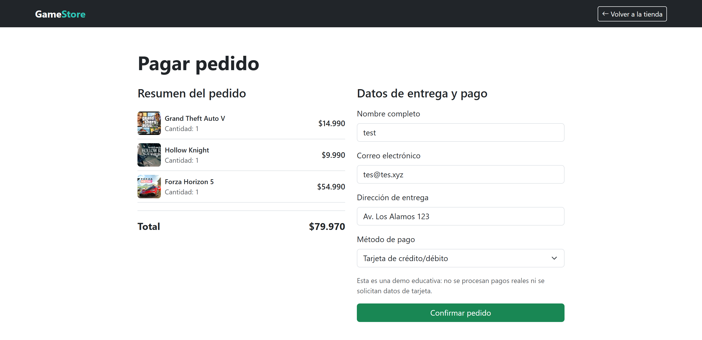
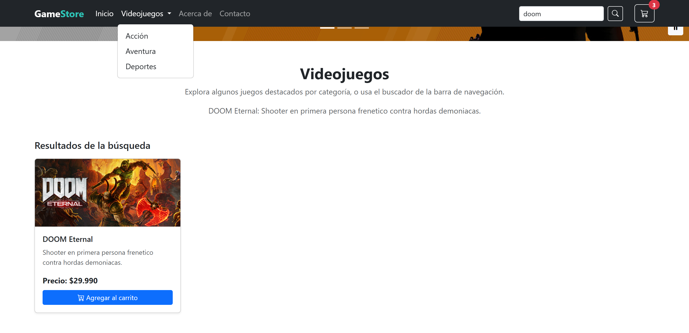
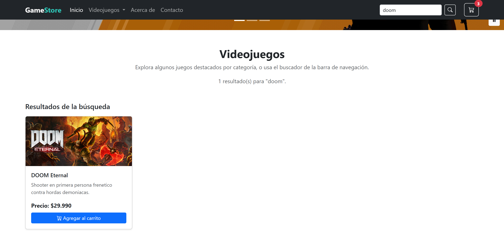

# Informe de Entrega: Game Store Interactiva

**Asignatura:** Desarrollo Frontend I
**Actividad:** Optimizando la Lógica y Rendimiento de una Página Web con JavaScript
**Estudiante:** Karla Santibáñez
**Fecha de entrega:** 16/09/2026

## 1. Descripción del proyecto

Game Store es una tienda web de videojuegos desarrollada con HTML, CSS, Bootstrap 5 y JavaScript. Esta entrega continúa el proyecto construido en la Semana 5 (catálogo dinámico, carrito persistente y pantalla de pago educativa) y lo extiende con los requisitos de la Semana 6: una barra de navegación con categorías simuladas, un formulario de búsqueda que reutiliza el catálogo ya cargado, y una reorganización de archivos que cumple la estructura de entrega solicitada (`index.html`, `assets/js/`, `assets/css/`, `assets/img/`).

## 2. Objetivo

Aplicar Bootstrap 5 y JavaScript avanzado para construir un sitio orientado a e-commerce que integre componentes responsivos (navbar, carrusel, cards), interacciones dinámicas mediante eventos, y consumo de datos desde un archivo JSON local a través de la Fetch API, manteniendo una estructura de código clara, reutilizable y documentada.

## 3. Desarrollo de la actividad

### 3.1 Maquetación con Bootstrap 5

El sitio usa el sistema de grillas de Bootstrap 5 (`row row-cols-*`) para las tarjetas de productos, `navbar-expand-lg` con colapso automático en móvil, un `carousel-fade` para los destacados y un `offcanvas` para el carrito. La navegación incluye un enlace de salto (`skip-link`) y atributos ARIA para accesibilidad.

### 3.2 Barra de navegación con categorías simuladas

El ítem **Videojuegos** del navbar es un dropdown de Bootstrap con las categorías **Acción**, **Aventura** y **Deportes**, cada una enlazada por ancla a su fila correspondiente del catálogo (`#row-accion`, `#row-aventura`, `#row-deportes`). Esto cumple el requisito de al menos dos categorías simuladas y es funcional tanto en escritorio como en el menú colapsado de móvil.

### 3.3 Manipulación del DOM

El archivo [assets/js/api/game_db.js](assets/js/api/game_db.js) crea las tarjetas del catálogo después de recibir los datos. La función `createGameCard()` utiliza `createElement` para construir cada elemento visual y `append`/`appendChild` para insertarlo en la página. La función `renderGamesByCategory()` filtra los juegos por categoría y actualiza cada contenedor dinámicamente.

El carrito también modifica el DOM en tiempo real: muestra productos, cantidades, totales y el contador ubicado en la barra de navegación.

### 3.4 Eventos implementados

| Evento | Elemento | Resultado de la interacción |
| --- | --- | --- |
| `click` | Botones **Agregar al carrito** y controles del carrito | Agrega, incrementa, disminuye, elimina o vacía productos; actualiza la cantidad y el total. |
| `submit` | Formulario de búsqueda ([search.js](assets/js/search.js)) | Filtra el catálogo ya cargado por nombre y muestra los resultados (o un aviso si no hay coincidencias), sin recargar la página. |
| `submit` | Formulario de pago ([checkout.js](assets/js/checkout.js)) | Valida los campos obligatorios, muestra una confirmación de pedido y vacía el carrito cuando los datos son válidos. |
| `mouseover` | Tarjetas de videojuegos | Resalta la tarjeta sobre la cual se encuentra el cursor y muestra su descripción en el estado del catálogo. |

### 3.5 Uso de Fetch API

El catálogo se encuentra en [games.json](assets/js/data/games.json). La función `loadGames()` ejecuta `fetch("./assets/js/data/games.json")`, verifica la respuesta HTTP y convierte la respuesta con `response.json()`. Los datos se guardan en `catalogoCompleto` (variable compartida con `search.js`) y se muestran dinámicamente agrupados por categoría.

### 3.6 Gestión de errores

Si la carga del JSON falla, `catch()` registra el error en consola y `setCatalogStatus()` muestra un mensaje visible y accesible (`aria-live="polite"`) para la persona usuaria, evitando que un fallo de red deje la página sin retroalimentación. Además, cada portada de videojuego tiene un manejador `error` que la reemplaza por una imagen local (`assets/img/no-image.svg`) si el recurso remoto no carga.

### 3.7 Organización y buenas prácticas

La lógica está organizada por responsabilidad, un archivo por función:

- [assets/js/api/game_db.js](assets/js/api/game_db.js): carga de datos externos y creación de tarjetas.
- [assets/js/search.js](assets/js/search.js): filtrado del catálogo por nombre a partir del formulario de búsqueda.
- [assets/js/cart.js](assets/js/cart.js): operaciones del carrito, persistencia mediante `localStorage` y actualización visual.
- [assets/js/checkout.js](assets/js/checkout.js): resumen del pedido y validación del formulario de pago.
- [assets/js/carrusel.js](assets/js/carrusel.js): pausa y reanudación accesible del carrusel.

### Mapa del codebase

```text
PFY2201_Exp2_S6_Karla_Santibáñez/
|-- README.md                         Informe de entrega y evidencias
|-- index.html                        Página principal y catálogo
|-- checkout.html                     Página de pago simulado
|-- docs/
|   |-- catalogo-interactivo.png      Captura del catálogo dinámico
|   |-- carrito-interactivo.png       Captura del carrito interactivo
|   |-- busqueda-interactiva.png      Captura del busqueda interactiva
|   |-- dropdown-categorias.png       Captura del dropdown de categorías
|   `-- checkout-interactivo.png      Captura del flujo de pago
`-- assets/
    |-- css/
    |   `-- style.css                 Estilos propios sobre Bootstrap
    |-- img/
    |   `-- no-image.svg              Portada de respaldo si falla la remota
    `-- js/
        |-- api/
        |   `-- game_db.js            Fetch API y renderizado del catálogo
        |-- data/
        |   `-- games.json            Fuente local del catálogo
        |-- search.js                 Filtro del catálogo (evento submit)
        |-- cart.js                   Carrito y almacenamiento local
        |-- carrusel.js                Pausa y reanudación del carrusel
        `-- checkout.js                Resumen y validación del pago
```

### Flujo de datos e interacción



Las funciones principales contienen comentarios que describen su propósito y el flujo de trabajo. Se reutilizan funciones existentes (`createGameCard`, `setCatalogStatus`, `getCart`) en vez de duplicar lógica.

## 4. Validación realizada

Se realizaron las siguientes comprobaciones sobre el proyecto ya reorganizado en `assets/`:

- Prueba mediante servidor HTTP local: `index.html`, `checkout.html`, `assets/css/style.css`, `assets/js/api/game_db.js`, `assets/js/search.js` y `assets/js/data/games.json` respondieron con código `200`.
- Prueba funcional en navegador: se confirmaron los 12 videojuegos cargados y distribuidos en sus 3 categorías (Acción, Aventura, Deportes).
- Prueba del dropdown de categorías: los tres enlaces apuntan a las filas correctas del catálogo.
- Prueba de búsqueda: se buscó "dota" y se mostró únicamente "Dota 2" en una sección de resultados; al vaciar el campo y reenviar el formulario se restauró el catálogo agrupado por categoría.
- Prueba del carrito: se agregaron 2 unidades de un juego gratuito y 1 de un juego pagado; el contador y el total se actualizaron correctamente ($29.990).
- Prueba de `checkout.html`: el resumen del pedido reflejó los mismos productos y el total del carrito.
- Prueba de manejo de errores: se forzó una portada rota y el `onerror` la reemplazó por `assets/img/no-image.svg`.
- Prueba de responsividad: el menú de navegación colapsa en viewport móvil (375px) y expone las categorías, el buscador y el carrito en el menú desplegado.

La página se probó en un navegador basado en Chromium. Se recomienda repetir estas acciones en Firefox y Microsoft Edge antes de la entrega final.

## 5. Evidencias

### Catálogo dinámico y evento `mouseover`



### Carrito y pantalla de pago con productos almacenados dinámicamente




### Dropdown y barra de búsqueda en navbar



## 6. Instrucciones de ejecución

La Fetch API requiere un servidor HTTP; por ese motivo, el proyecto se puede previsualizar ya sea levantando un servidor con Python o utilizando una extensión de VS Code:

- Con Python (desde la carpeta del proyecto):

```powershell
python -m http.server 8080
```

- Extensiones VSCode
  - [Live Server | Ritwick Deyer](https://marketplace.visualstudio.com/items?itemName=ritwickdey.LiveServer)
  - [Live Preview | Microsoft](https://marketplace.visualstudio.com/items?itemName=ms-vscode.live-server)

Luego, abrir `http://localhost:8080` en el navegador.

## 7. Repositorio y entrega

**Repositorio GitHub:** [kbsg01/DF_I-Fundamentos_HTML_CSS](https://github.com/kbsg01/DF_I-Fundamentos_HTML_CSS)

## 8. Conclusión

Esta entrega consolida el trabajo de la Semana 5 y lo lleva al nivel pedido en la Semana 6: la tienda ahora ofrece una barra de navegación con categorías reales, un buscador funcional sobre el catálogo ya cargado, y una organización de archivos alineada con la estructura de entrega (`assets/js`, `assets/css`, `assets/img`). El catálogo se sigue cargando de forma dinámica vía Fetch API, las acciones del usuario generan retroalimentación inmediata, y el flujo de compra completo (agregar al carrito, buscar, pagar) demuestra la integración de los contenidos trabajados durante ambas semanas.
