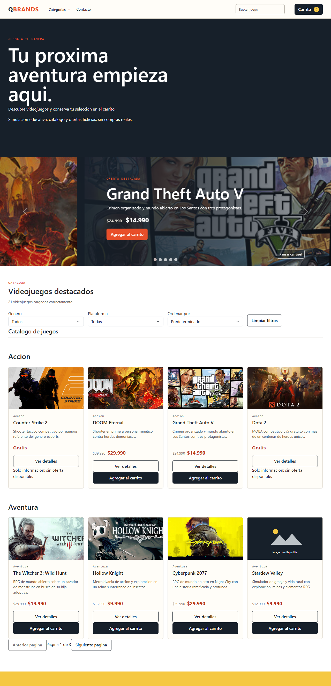
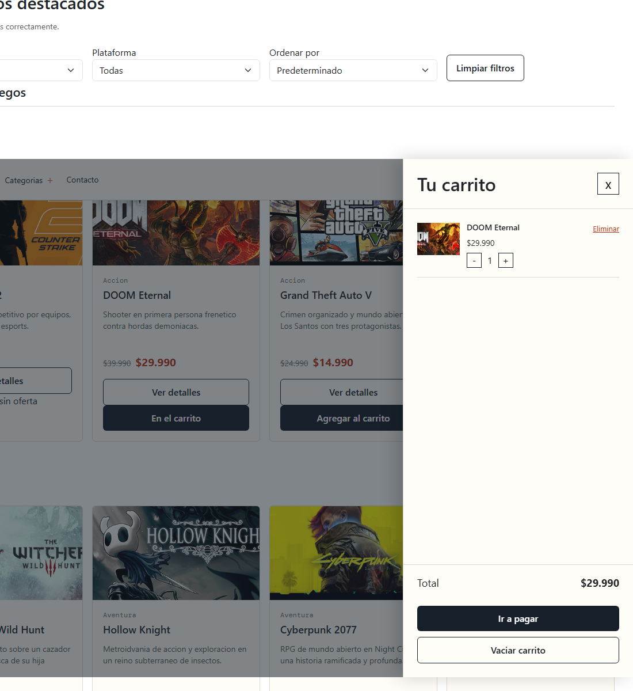
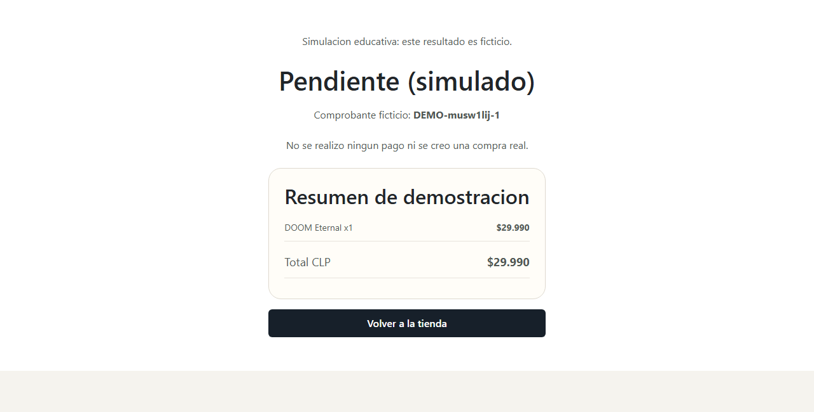

# Q Brands

Tienda React/Vite para una demostracion educativa de descubrimiento de videojuegos y carrito.

## Alcance

- Catalogo de 21 entradas locales en `public/data/products.json`.
- Busqueda, filtros de genero/plataforma, orden, paginacion y detalle.
- Ofertas y disponibilidad ficticias, expresadas en CLP.
- Carrito persistente en `localStorage` con operaciones y totales enteros.
- Perfil de acceso local y recibos de compra simulados; no son cuentas, pedidos ni pagos reales.
- No hay backend, RAWG, Supabase, pasarela, credenciales ni captura de datos personales/de pago.
- Las portadas pueden solicitar imagenes estaticas de CDN; si fallan, se usa un placeholder. No se consultan APIs de negocio.

## Desarrollo local

Requisitos: Node.js 22.12+ y npm.

```powershell
npm ci
npm run dev
npm test
npm run test:e2e
npm run build
npm run preview
```
El servidor de desarrollo y `npm run preview` usan la raiz `/`. Para generar el artefacto de Pages,
establece `$env:VITE_BASE_PATH = '/DF_I-Fundamentos_HTML_CSS/'` y ejecuta `npm run build`; la guia
de [validacion](specs/001-game-store/quickstart.md) explica como montar localmente esa subruta.
`VITE_BASE_PATH` a `/DF_I-Fundamentos_HTML_CSS/` antes de `npm run build`.

## Arquitectura

- `src/services/catalogApi.js` carga y valida el JSON local con retry/cancelacion.
- `src/hooks/useCatalog.js` controla loading, success, error y retry.
- `src/context/CartContext.jsx` mantiene un unico carrito, reducer puro y persistencia `qBrandsCart`.
- `src/services/demoCheckout.js` valida lineas y crea un comprobante efimero ficticio.
- `src/components/` contiene catalogo, detalle, acceso de demo, carrito y checkout simulado.

## Publicacion

Demo publicada: [Q Brands en GitHub Pages](https://kbsg01.github.io/DF_I-Fundamentos_HTML_CSS/).

Repositorio: [Q Brands en GitHub](https://github.com/kbsg01/DF_I-Fundamentos_HTML_CSS). El workflow
de [publicacion](https://github.com/kbsg01/DF_I-Fundamentos_HTML_CSS/actions/runs/37161050545)
paso calidad y despliegue; Pages sirve la rama `gh-pages` desde `/`. El catalogo, acceso y checkout
siguen siendo demostrativos y locales.

## Evidencia S8

1. **Estados:** catalogo, carrito e interacciones usan estado React; cubiertos por pruebas unitarias y E2E.
2. **Carga dinamica:** `useEffect` carga el JSON local; la URL publica responde HTTP 200.
3. **Vistas condicionales:** carga, catalogo, carrito y resultados simulados se muestran en las [capturas](#evidencias) y pruebas E2E.
4. **Organizacion:** el codigo se separa en componentes, hooks, servicios y contexto; lint y build pasan.
5. **Publicacion:** la [demo publica](https://kbsg01.github.io/DF_I-Fundamentos_HTML_CSS/) y el [repositorio](https://github.com/kbsg01/DF_I-Fundamentos_HTML_CSS) son accesibles.

El detalle de ejecuciones, artefactos y gaps esta en [validacion S8](docs/s8-validation.md).

## Evidencias






