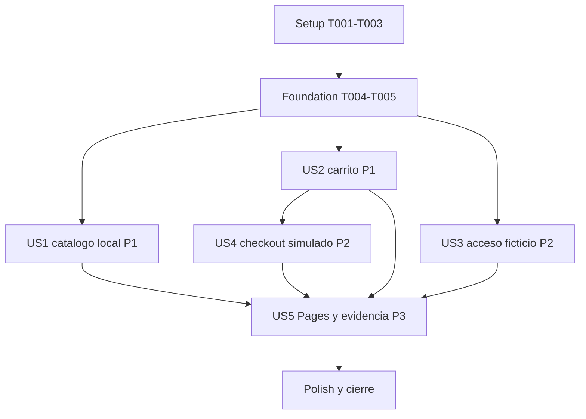

# Tasks: Q Brands - Tienda de juegos con acceso y compra

**Input**: Design documents from `specs/001-game-store/`.
**Prerequisites**: [plan.md](plan.md), [spec.md](spec.md), [research.md](research.md), [data-model.md](data-model.md), [storefront contract](contracts/storefront.md), [backend scope](contracts/backend.md), [quickstart.md](quickstart.md).
**Created**: 2026-10-03. Rama: `s8`.

**Tests**: Se incluyen tareas de pruebas porque el plan y los criterios de aceptacion exigen validacion con Vitest/Testing Library y Playwright. Todas las pruebas usan datos locales; no se crean pruebas de proveedores.

**Organization**: Las tareas siguen las cinco historias y mantienen el orden incremental. Todas empiezan sin marcar. Este comando solo genera el plan de trabajo; no instala dependencias, elimina configuracion, ejecuta pruebas ni publica.

## Format: `[ID] [P?] [Story] Description`

- Cada tarea usa checkbox sin marcar, ID secuencial y ruta exacta.
- `[P]` indica archivos distintos que pueden trabajarse en paralelo una vez completas sus dependencias.
- `[US1]` a `[US5]` corresponden a las historias de `spec.md`; Setup, Foundation y Polish no llevan etiqueta de historia.
- `Deps:` enumera las dependencias directas. Las dependencias transitivas tambien deben estar completas.

## Path Conventions

- SPA y catalogo local: `src/`, `public/data/products.json`.
- Pruebas existentes/configuradas: `tests/unit/`, `tests/e2e/`, `tests/fixtures/`.
- Evidencia academica: `docs/s8-validation.md` y `docs/s8/`.
- El hosting publico es GitHub Pages con la subruta `/DF_I-Fundamentos_HTML_CSS/`.
- No crear backend, variables de proveedores, secretos, cuentas, pedidos ni pagos reales.

---

## Phase 1: Setup (Shared Infrastructure)

**Purpose**: Alinear configuracion heredada y fixtures con un unico build estatico.

- [X] T001 [P] Retirar `@supabase/supabase-js` y el script `test:integration` de `package.json`/`package-lock.json`; quitar variables de servicios de `.env.example` y `.env.backend.example` y retirar la configuracion Supabase de `supabase/` sin alterar `.gitignore` generico. Deps: ninguna.
- [X] T002 [P] Configurar el base path estatico de Pages y la raiz local de desarrollo en `vite.config.js`; mantener los recursos de produccion bajo `import.meta.env.BASE_URL`. Deps: ninguna.
- [X] T003 [P] Reemplazar las respuestas de proveedores por catalogo/ofertas deterministas de demostracion en `tests/fixtures/storefront.js` y conservar el aislamiento de storage en `tests/setup.js`. Deps: ninguna.

---

## Phase 2: Foundational (Blocking Prerequisites)

**Purpose**: Definir el limite comun de datos que catalogo, carrito y checkout usan sin servicios externos.

- [X] T004 Crear casos unitarios del schema local, CLP entero, oferta incompleta y metadata opcional en `tests/unit/demoProducts.test.js`, usando fixtures y criterios de `data-model.md`. Deps: T003.
- [X] T005 Implementar normalizacion/validacion pura del catalogo y sus ofertas ficticias en `src/utils/demoProducts.js`; rechazar ofertas incompletas, cantidades/precios invalidos y no realizar solicitudes de red. Deps: T004.

**Checkpoint**: Setup/Foundation listos; desde aqui US1, US2 y US3 pueden avanzar en paralelo con fixtures locales.

---

## Phase 3: User Story 1 - Descubrir juegos y comparar ofertas (Priority: P1) - MVP

**Goal**: Explorar el JSON local, filtrar y consultar informacion/ofertas ficticias sin llamadas a APIs.
**Independent Test**: Cargar el catalogo, buscar un titulo, combinar filtros de genero/plataforma, abrir su detalle y probar loading/error/empty/retry sin iniciar acceso ni compra.

### Tests for User Story 1

- [X] T006 [P] [US1] Probar `fetchCatalog` con JSON local, respuesta invalida, fallo recuperable, retry y cancelacion en `tests/unit/catalogApi.test.js`. Deps: T005.
- [X] T007 [P] [US1] Cubrir busqueda, filtros, reset, detalle, oferta ausente e imagen alternativa en `tests/e2e/catalog.spec.js`, sin interceptar ni invocar APIs de negocio externas. Deps: T002, T003.

### Implementation for User Story 1

- [X] T008 [P] [US1] Completar los campos locales requeridos por `FR-001` y `FR-003` en `public/data/products.json`, preservando IDs/precios existentes y rotulando como demostracion los valores comerciales ficticios. Deps: T005.
- [X] T009 [US1] Hacer que `src/services/catalogApi.js` consuma exclusivamente `BASE_URL/data/products.json` y valide sus entradas con el helper local, conservando reintentos/cancelacion sin upstream. Deps: T005, T008.
- [X] T010 [US1] Completar estados loading/success/error/retry y limpieza de peticiones en `src/hooks/useCatalog.js`, evitando resultados obsoletos y manteniendo disponible el carrito ante fallos. Deps: T009.
- [X] T011 [US1] Implementar busqueda, filtros de genero/plataforma, orden nombre/lanzamiento, reset y paginacion sin duplicados en `src/components/ProductCatalog.jsx`, usando unicamente entradas locales. Deps: T008, T010.
- [X] T012 [P] [US1] Crear la vista accesible de detalle con metadata, condiciones de oferta, atribucion aplicable y fallbacks en `src/components/ProductDetail.jsx`. Deps: T008.
- [X] T013 [US1] Integrar detalle y disponibilidad en `src/App.jsx` y `src/components/ProductCard.jsx`; no permitir agregar juegos sin oferta completa. Deps: T011, T012.
- [X] T014 [US1] Ejecutar las pruebas de `tests/unit/catalogApi.test.js` y `tests/e2e/catalog.spec.js`, comprobar `FR-001` a `FR-005`, `SC-001` y `SC-007`, y anotar resultados/gaps en `docs/s8-validation.md`. Deps: T006, T007, T013.

**Checkpoint**: MVP de descubrimiento y comparacion local, independiente de acceso y checkout.

---

## Phase 4: User Story 2 - Preparar y conservar el carrito (Priority: P1)

**Goal**: Mantener operaciones, contador, totales CLP y persistencia del carrito existente.
**Independent Test**: Con fixtures locales, agregar dos productos, incrementar/decrementar, eliminar, vaciar y recargar; comparar lineas, contador y total.

### Tests for User Story 2

- [X] T015 [P] [US2] Probar transiciones, cantidades, total CLP, carrito vacio, JSON corrupto, storage fallido y compatibilidad del array `qBrandsCart` en `tests/unit/cart.test.jsx`. Deps: T003, T005.
- [X] T016 [P] [US2] Probar agregar/quitar, drawer vacio, reload y seleccion visible en `tests/e2e/cart.spec.js`, usando ofertas fixture y sin depender de US1 remoto. Deps: T002, T003.

### Implementation for User Story 2

- [X] T017 [US2] Mantener reducer puro y API unica mientras `src/context/CartContext.jsx` migra de `useReducer` a setter funcional `useState`; preservar `qBrandsCart`, lineas validas y recuperacion de errores de storage. Deps: T015.
- [X] T018 [US2] Asegurar aritmetica CLP entera y subtotales consistentes en `src/utils/currency.js` y `src/context/CartContext.jsx`, sin duplicar calculos en componentes. Deps: T017.
- [X] T019 [US2] Implementar controles accesibles de cantidad, eliminar/vaciar, vacio, foco/restauracion y bloqueo con carrito vacio en `src/components/CartDrawer.jsx`. Deps: T017, T018.
- [X] T020 [US2] Mostrar estado seleccionado al agregar, sin impedir cambios de cantidad y leyendo presencia solo desde `useCart`, en `src/components/ProductCard.jsx`. Deps: T013, T017, T018.
- [X] T021 [US2] Ejecutar las pruebas de `tests/unit/cart.test.jsx` y `tests/e2e/cart.spec.js`, verificar `FR-006` a `FR-008` y `SC-002`, y registrar migracion/persistencia en `docs/s8-validation.md`. Deps: T015, T016, T019, T020.

**Checkpoint**: Carrito demostrable con ofertas fixture, incluso si falla la carga del catalogo.

---

## Phase 5: User Story 3 - Acceder a una cuenta (Priority: P2)

**Goal**: Demostrar activar/cerrar un perfil ficticio sin autenticacion ni datos personales.
**Independent Test**: Activar y cerrar el perfil, comprobar su etiqueta de demo y que el estado vuelva a visitante tras recargar; el carrito permanece.

### Tests for User Story 3

- [X] T022 [P] [US3] Probar estados visitante/perfil ficticio, rotulo, reinicio tras reload y ausencia de campos personales en `tests/unit/demoAccess.test.jsx`. Deps: T003.
- [X] T023 [P] [US3] Cubrir activar/cerrar perfil y conservar carrito en `tests/e2e/access-demo.spec.js`, verificando que no aparecen formularios de cuenta. Deps: T002, T003.

### Implementation for User Story 3

- [X] T024 [US3] Crear el control `src/components/DemoAccess.jsx` con un perfil fijo, etiqueta educativa y acciones activar/cerrar, sin credenciales, email ni persistencia. Deps: T022.
- [X] T025 [US3] Asignar el estado efimero con `useState` e integrar `DemoAccess` en `src/App.jsx`, volviendo a visitante al recargar y sin condicionar el carrito. Deps: T024.
- [X] T026 [US3] Ejecutar las pruebas de `tests/unit/demoAccess.test.jsx` y `tests/e2e/access-demo.spec.js`, verificar `FR-009`, `FR-014` y `SC-003`, y registrar resultados en `docs/s8-validation.md`. Deps: T022, T023, T025.

**Checkpoint**: El acceso es solo una demostracion visual; no existe cuenta o sesion autenticada.

---

## Phase 6: User Story 4 - Revisar y simular una compra (Priority: P2)

**Goal**: Mostrar importe y comprobante ficticio con cuatro estados sin crear pedido/pago ni pedir datos personales.
**Independent Test**: Desde carrito local, validar resumen, importe, estados aprobado/rechazado/cancelado/pendiente, no duplicacion y conservacion correcta del carrito.

### Tests for User Story 4

- [X] T027 [P] [US4] Probar validacion del resumen, resultado/ID ficticio, no duplicacion y ausencia de persistencia en `tests/unit/checkout.test.jsx`. Deps: T003, T005.
- [X] T028 [P] [US4] Probar flujo de checkout sin credenciales/contacto/pago, cuatro resultados, avisos y carrito en `tests/e2e/checkout.spec.js`. Deps: T002, T003.

### Implementation for User Story 4

- [X] T029 [US4] Implementar validacion y generacion efimera del comprobante con estados simulados en `src/services/demoCheckout.js`; no llamar red ni guardar pedidos/transacciones. Deps: T027.
- [X] T030 [US4] Reemplazar el formulario personal/pago de `src/components/Checkout.jsx` por resumen CLP, aviso persistente de simulacion, selector de resultado, validacion nativa y salida ficticia sin doble envio. Deps: T018, T029.
- [X] T031 [US4] Al resultado aprobado retirar solo las lineas/cantidades del snapshot enviado y conservar el carrito en otros resultados, coordinando `src/components/Checkout.jsx` con `src/context/CartContext.jsx`. Deps: T030.
- [X] T032 [US4] Ejecutar las pruebas de `tests/unit/checkout.test.jsx` y `tests/e2e/checkout.spec.js`, verificar `FR-010` a `FR-013`, `SC-004` y `SC-005`, y documentar que no hubo transaccion en `docs/s8-validation.md`. Deps: T027, T028, T031.

**Checkpoint**: Aprobado/rechazado/cancelado/pendiente son solo estados didacticos, nunca una compra real.

---

## Phase 7: User Story 5 - Evaluar la entrega de S8 (Priority: P3)

**Goal**: Publicar un unico sitio estatico y entregar enlaces/evidencias verificables.
**Independent Test**: Abrir la URL publica Pages y el repositorio; comprobar base path, catalogo JSON, assets y los recorridos/evidencias sin credenciales.

### Tests for User Story 5

- [X] T033 [P] [US5] Probar carga del build en el base path de Pages, JSON/assets locales, enlace al repo y ausencia de llamadas de negocio externas en `tests/e2e/publication.spec.js`. Deps: T002, T003.

### Implementation for User Story 5

- [X] T034 [P] [US5] Crear o actualizar `.github/workflows/deploy-pages.yml` para correr `npm ci`, unit/E2E, lint y build; tras despacho manual/entorno aprobado, usar `peaceiris/actions-gh-pages@v4.1.0` con `contents: write`, `publish_branch: gh-pages` y `publish_dir: ./dist`, sin Vercel ni secretos de proveedores. Deps: T001, T002, T033.
- [X] T035 [P] [US5] Documentar el alcance local, comandos y URL Pages una vez disponible en `README.md`, sin inventar dominios ni anunciar login/pago real. Deps: T013, T021, T026, T032.
- [X] T036 [US5] Capturar catalogo, carrito y vistas condicionales en `docs/s8/catalog.png`, `docs/s8/cart.png` y `docs/s8/conditional.png`, sin datos personales y con los resultados rotulados como ficticios. Deps: T014, T021, T026, T032.
- [ ] T037 [US5] Con autorizacion explicita y workflow aprobado, publicar el build estatico de `.github/workflows/deploy-pages.yml`; verificar URL, base path, JSON, assets y acceso publico, y registrar evidencia en `docs/s8-validation.md`. Deps: T034, T035, T036.
- [ ] T038 [US5] Verificar `FR-017` y `SC-008` revisando enlaces repo/Pages, las tres evidencias y los cinco criterios S8 en `README.md` y `docs/s8-validation.md`; registrar cualquier bloqueo de permisos. Deps: T037.

**Checkpoint**: No publicar durante desarrollo sin el despacho autorizado; la demo publica no activa integraciones.

---

## Phase 8: Polish & Cross-Cutting Concerns

**Purpose**: Cerrar accesibilidad, documentacion y gates de calidad del alcance local.

- [X] T039 [P] Auditar teclado, nombres, foco, reduced-motion, solapamientos y 360/1280 px en `src/App.css`, `src/index.css` y `tests/e2e/accessibility.spec.js`; corregir solo problemas de los flujos cubiertos. Deps: T014, T021, T026, T032.
- [X] T040 Retirar la linea residual de checkout sandbox/cuenta real de `specs/001-game-store/quickstart.md` y alinear la guia con JSON local, pruebas locales y Pages estatico. Deps: T001, T032.
- [X] T041 Ejecutar `npm test`, `npm run test:e2e`, `npm run lint`, `npm run build` y montar `dist` localmente bajo la subruta Pages para smoke, y registrar resultados reales/gaps en `docs/s8-validation.md`; no invocar `test:integration` ni servicios. Deps: T014, T021, T026, T032, T039, T040.
- [ ] T042 Revisar cobertura `FR-001` a `FR-017`, `SC-001` a `SC-008`, la constitucion y ausencia de imports/solicitudes a proveedores en `package.json`, `src/` y `docs/s8-validation.md`; dejar abierto lo que no tenga evidencia. Deps: T038, T041.

**Checkpoint**: Cerrar solo con las pruebas definidas, lint/build y evidencia de Pages autorizada; ningun estado simulado se reporta como real.

---

## Dependencies & Execution Order

### Phase Dependencies

- Setup T001-T003 precede Foundation T004-T005; Foundation bloquea todas las historias.
- US1 y US2 son P1 y pueden avanzar en paralelo tras Foundation; US3 tambien se prueba de forma independiente.
- US4 depende de US2 porque reutiliza el carrito; no depende de identidad real ni de US3.
- US5 requiere las cinco historias para la entrega/evidencias completas. Configurar tests/workflow puede prepararse antes, pero el despacho de Pages espera autorizacion y calidad aprobada.
- Polish depende de las historias y, para T042, de las evidencias/verificaciones previas.

### User Story Dependencies



### Within Each User Story

1. Escribir los casos unitarios/E2E definidos y comprobar que describen el comportamiento esperado.
2. Implementar modelo/utilidad antes de componentes que la consumen.
3. Ejecutar los tests de la historia despues de integrar UI; actualizar `docs/s8-validation.md` con resultados reales.
4. Mantener el perfil/recibo en estado local, sin credenciales, pagos, pedidos ni APIs.

### Parallel Opportunities

- Setup: T001, T002 y T003 editan archivos distintos.
- US1: T006/T007/T008 pueden avanzar en paralelo tras Foundation; T012 usa un archivo distinto y se puede paralelizar con T011 despues del schema.
- US2: T015 y T016 en paralelo; no editar `CartContext.jsx` simultaneamente con T017/T018.
- US3: T022 y T023 en paralelo; integrar `App.jsx` despues de ambos.
- US4: T027 y T028 en paralelo; helper/UI comienzan tras terminar sus contratos de prueba.
- US5: T033 y T034 en paralelo una vez definido el base path; T035 puede documentar mientras se preparan capturas T036.

### Parallel Examples

```text
US1: T006 tests unitarios + T007 E2E + T008 datos locales
US2: T015 pruebas del carrito + T016 recorrido de navegador
US3: T022 pruebas unitarias + T023 recorrido de perfil demo
US4: T027 pruebas de checkout + T028 flujo de navegador
US5: T033 prueba base path + T034 workflow de Pages
```

## Implementation Strategy

### MVP First (User Story 1)

1. Completar Setup y Foundation sin instalar proveedores ni configurar secretos.
2. Terminar US1: catalogo JSON, filtros y detalle con errores recuperables.
3. Validar US1 de forma independiente y mostrar la demo local.
4. No incluir perfil ni checkout en el MVP inicial; agregarlos como incrementos posteriores.

### Incremental Delivery

1. US1 ofrece descubrimiento local.
2. US2 agrega carrito persistente compatible con semanas anteriores.
3. US3 agrega estados de acceso ficticios.
4. US4 agrega resultados de compra simulados y aviso persistente.
5. US5 publica estaticamente solo despues de calidad/aprobacion, y completa evidencia S8.

### Traceability

| Requisitos | Tareas principales | Evidencia |
| --- | --- | --- |
| FR-001, FR-002, FR-005 | T006-T014 | JSON local, filtros/detalle y estados recuperables |
| FR-003, FR-004 | T004-T014 | oferta completa/local y atribucion aplicable |
| FR-006, FR-007, FR-008 | T015-T021 | acciones, totales, persistencia y estados del carrito |
| FR-009, FR-014 | T022-T026 | perfil ficticio, sin credenciales ni datos personales |
| FR-010, FR-011, FR-012, FR-013 | T027-T032 | resumen, cuatro estados y comprobante efimero |
| FR-015, FR-016 | T039-T041 | accesibilidad, viewports y regresion S6/S7 |
| FR-017 | T033-T038 | Pages, enlaces, capturas y criterios S8 |

SC-001/SC-007 -> T006-T014; SC-002 -> T015-T021; SC-003 -> T022-T026;
SC-004/SC-005 -> T027-T032; SC-006 -> T039/T041; SC-008 -> T033-T038.

## Notes

- Total: 42 tareas. Setup 3, Foundation 2, US1 9, US2 7, US3 5, US4 6, US5 6, Polish 4.
- Todas las tareas comienzan sin marcar y deben permanecer abiertas hasta tener evidencia.
- T001 elimina SDK/configuracion/variables heredadas; no se sustituyen por otro backend.
- T037 es la unica tarea que despacha/publica Pages y requiere autorizacion explicita.
- No hay tests de integracion con proveedores ni historias de cobro/entrega real.
- No se deben agregar credenciales, configurar Vercel, crear cuentas ni hacer commits en este flujo.
